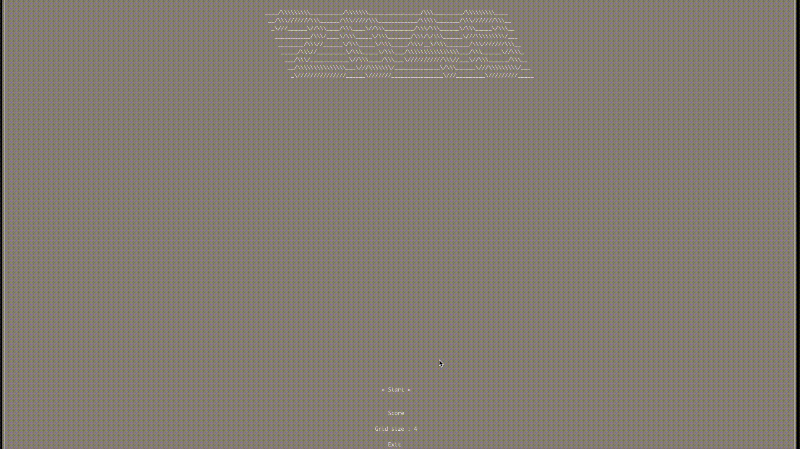

# 42 wong kar wai

This project was carried out as part of the school 42. The objective is to recreate the game 2048 using the C language and the ncurses library.

2048 is a puzzle game in which the player combines numbered tiles to reach the 2048 tile and win. The game takes place on a 4x4 grid where new tiles appear after each move by the player. The player can move the tiles in four directions: up, down, left, and right. If two tiles with the same number collide during a move, they merge to form a tile with double the value.


## Usage

### Local

Ncurses is required ⚠️

```bash
make run
```

### Docker

```bash
make build_docker_image
make run_docker_container
2048
```

## Controls

- Use the arrow keys to move the tiles in the game.
- Also, use the arrow keys to navigate through the menus.
- Press the 'Enter' key to confirm a selection in the menus.
- Press the 'ESC' key to quit the game at any time.

## Demo



